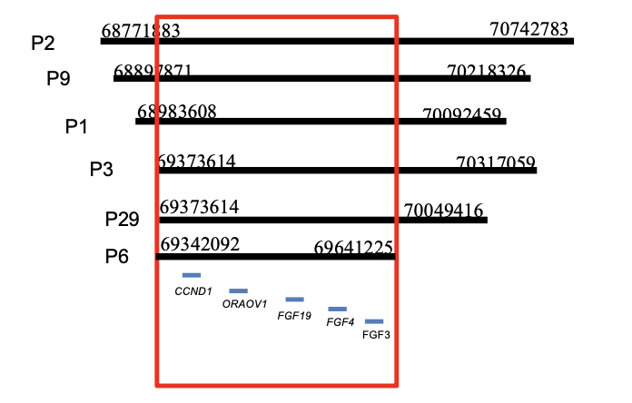
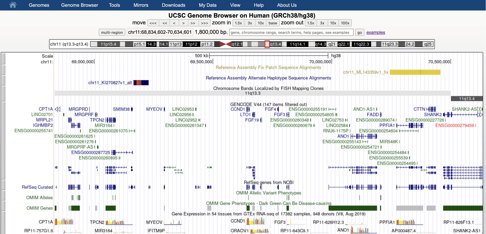

### The power of biological databases

Let's assume we have laboratory results from patients suffering from head and neck cancer.

We want to specifically analyze the ch11q.13.3 region. Thus, gathering the data we have, we obtain the following information:

| Patient | Gain of 11q.13.3 | Start    | Stop       | Length  | Affected Genes                                                                                    |
| ------- | ---------------- | -------- | ---------- | ------- | ------------------------------------------------------------------------------------------------- |
| 1       | yes              | 68983608 | 70092459   | 1108851 | MYEOV, CCND1, ORAOV1, FGF19, FGF4, FGF3, ANO1, FADD                                               |
| 2       | yes              | 68771883 | 70,742,783 | 1970900 | MRGPRF, TPCN2, MYEOV, CCND1, ORAOV1, FGF19, FGF4, FGF3, ANO1, FADD, PPFIA1, MIR548K, CTTN, SHANK2 |
| 3       | yes              | 69373614 | 70317059   | 983445  | CCND1, ORAOV1, FGF19, FGF4, FGF3, ANO1, FADD, PPFIA1, MIR548K, CTTN, SHANK2                       |
| 6       | yes              | 69342092 | 69641225   | 299133  | CCND1, ORAOV1, FGF19, FGF4, FGF3                                                                  |
| 9       | yes              | 68897871 | 70218326   | 1320455 | MYEOV, CCND1, ORAOV1, FGF19, FGF4, FGF3, ANO1, FADD, PPFIA1, MIR548K                              |
| 10      | no               |          |            |         |                                                                                                   |
| 16      | no               |          |            |         |                                                                                                   |
| 25      | no               |          |            |         |                                                                                                   |
| 29      | yes              | 69373614 | 70049416   | 675802  | CCND1, ORAOV1, FGF19, FGF4, FGF3, ANO1, FADD                                                      |
| 31      | no               |          |            |         |                                                                                                   |

To better understand the start and the end position, if, for instance, a genomic region has a start position of 69342092 and a stop position of 69342192, it means the region spans from nucleotide 69342092 to 69342192 on the chromosome.

11q.13.3 region translates as subregion 13.3 of the long arm (q) of chromosome 11.

The above table concludes that the common genes affected along the 11q.13.3 region are: CCND1, ORAOV1, FGF19, FGF4, FGF3. I summed this information up visually and using Excel files. You can imagine that this is not an effective approach, especially for a large dataset.

Next steps would be to:

- Find this common region in the Genome Browser database:

  > We can notice the genes of interest and by clicking on one of them, we can find out if it's relevant or not regarding our data. For instance, [CCND1](https://genome.ucsc.edu/cgi-bin/hgGene?hgg_gene=ENST00000227507.3&hgg_chrom=chr11&hgg_start=69641155&hgg_end=69654474&hgg_type=knownGene&db=hg38) proves "interact with tumor suppressor protein Rb and the expression of this gene is regulated positively by Rb. Mutations, amplification and overexpression of this gene, which alters cell cycle progression, are observed frequently in a variety of human cancers."

- Are there any scientific articles linking CCND1 to head and neck cancer? Visit [PubMed](https://pubmed.ncbi.nlm.nih.gov/?term=head+and+neck+cancer+ccnd1).

- We can also check if the gene is associated with any pathology using the OMIM database. In this [case](https://www.omim.org/entry/168461?search=CCND1&highlight=ccnd1), CCND1 is associated with three cancer phenotypes, one of which is thought to become the deadliest type in the following 10 years - colorectal cancer.

- Further questions: Are all genes the same size? And the same number of exons? What is the size in bp and the number of exons of the CCND1 gene? [NCBI](https://www.ncbi.nlm.nih.gov/search/all/?term=CCND1) helps us out again.

- But, how many amino acids does the protein encoded by the CCND1 gene have? One search on [UniProt](https://www.uniprot.org/uniprotkb/P24385/entry) and we can easily find the answer.

---

It is bewildering to me how we live in a world where we actually have a near-complete set of instructions that says everything about our bodies, all possible because of databases. Still, everything is so unpredictable. We may have so many questions, not so many answers unfortunately. But, as we all know, science is not the truth. Science is finding the truth.
